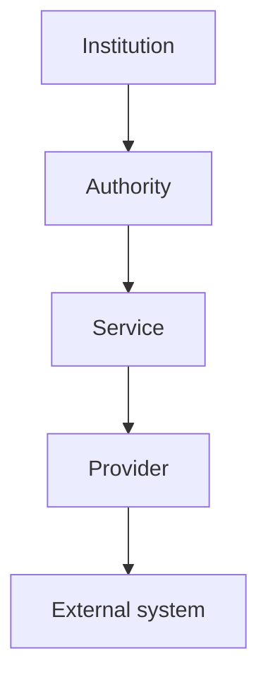

# Infrastructure

## Aetheric Forge Runtime 2.0

Infrastructure connects the constitutional runtime to concrete storage, transport, serialization, identity, hosting, and operational technologies.

Institutional contracts define what the Runtime must accomplish. Infrastructure determines how those capabilities are realized in a particular environment.

This document defines infrastructure boundaries and responsibilities. It does not require a particular database, message broker, object store, serialization format, dependency-injection framework, operating system, or deployment platform.

---

## Infrastructure Principles

### Institutions do not depend upon technologies

An Institution depends upon contracts representing the capabilities it requires. It does not depend directly upon a database client, message broker, filesystem, cloud SDK, or network protocol.

Technology-specific dependencies remain behind provider or adapter interfaces.

### Providers implement mechanisms, not constitutions

A provider may store, transmit, serialize, query, or authenticate. It does not redefine the purpose, authority, or invariants of the Institution using it.

Substituting a provider may change performance, capacity, availability, or operational guarantees. It must not silently change the constitutional meaning of the capability.

### Infrastructure guarantees are explicit

Persistence, delivery, ordering, durability, consistency, confidentiality, and availability are not inferred from an interface name.

Each provider must make its operational guarantees and limitations discoverable through contract, configuration, or documentation.

### Deployment is composition

A deployment selects providers, configuration, lifetimes, and topology appropriate to its environment.

The same institutional model may operate in memory, in one process, across several services, or through externally managed infrastructure without acquiring a different constitutional identity.

---

## Infrastructure Position

This is a responsibility map, not a requirement that every operation pass through five objects.

A provider may directly fulfil a narrower service contract when both represent the same responsibility. Layers should exist to preserve a meaningful boundary, not to satisfy an architectural headcount.

---

## Providers

A **Provider** implements a replaceable runtime capability using a concrete mechanism.

A provider contract should describe:

- the operations supplied;
- accepted and returned abstractions;
- cancellation behaviour;
- ownership of resources;
- expected failure modes;
- applicable consistency or delivery guarantees; and
- provider identity or selection information where several providers may coexist.

Provider contracts should not expose technology-specific types unless the purpose of the contract is explicitly technology-specific.

### Provider identity

When several providers serve one runtime service, each provider requires a stable selection identity.

For example, an Archive provider identifies the store it serves. An archival reference retains that store identity so subsequent operations can be routed to the same provider.

Provider identity is operational. It does not become the identity of the Institution or the Knowledge being handled.

### Direct contract implementation

A provider may implement another infrastructure contract directly when it supplies the complete behaviour of that contract.

In the Archive model, an `IArchiveProvider` may implement `IArchiveVault`. This is appropriate when the provider itself supplies the vault operations and no separate adapter adds policy, coordination, or ownership.

The Runtime should not preserve an empty wrapper solely because an earlier design drew two boxes.

---

## Archive Infrastructure

The Archive separates constitutional archival responsibility from storage technology.

### Archive Institution

`IArchive` is the public institutional capability. It owns its Archivist and presents archival operations to institutional consumers.

### Archivist

The Archivist coordinates object-level archival work, including selection of an appropriate serializer and use of Archive services.

The Archivist remains an Authority of the Archive. It is not a storage provider.

### Vault

`IArchiveVault` represents the storage capability used by the Archive Institution.

The vault accepts content and metadata, returns archival references, and supports retrieval, inspection, existence checks, and deletion according to its contract.

### Archive service

The Archive service coordinates multiple Archive providers where several stores are available.

It routes operations by store identity and rejects requests for unknown stores. It does not erase provider-specific failure or substitute an arbitrary store when selection fails.

### Archive provider

`IArchiveProvider` binds archival operations to a named store.

A provider is responsible for preserving the relationship among:

- store identity;
- content key;
- archived content;
- archival metadata; and
- returned Archive reference.

An Archive provider may also implement `IArchiveVault` when it directly fulfils the vault contract.

### Archive references

An Archive reference identifies archived content through stable operational information, including the store responsible for it.

References must remain independent of concrete provider classes. A consumer should not need a provider instance to interpret a reference sufficiently for the Archive service to route it.

### Metadata

Archive metadata describes stored content without replacing or mutating that content.

Metadata may include content type and other information required for interpretation, provenance, integrity, or policy. Missing metadata must remain distinguishable from fabricated defaults when the distinction affects interpretation.

---

## Serialization

Serialization converts a runtime representation into a form suitable for storage or transmission and reconstructs a compatible runtime representation from that form.

A serializer is selected through an explicit representation identifier, ordinarily a content type or equivalent format contract.

Serialization infrastructure should preserve:

- declared content type;
- semantic compatibility;
- stream ownership;
- cancellation;
- version or schema information where required; and
- failure when no compatible serializer exists.

The absence of a serializer must not cause content to be interpreted under an unrelated format.

Serialization does not determine the identity of a Knowledge Artifact. Different representations may express the same Artifact, and identical bytes do not by themselves establish shared constitutional identity.

---

## Post Infrastructure

The Post Office separates postal semantics from delivery technology.

### Post Office Institution

`IPostOffice` accepts Envelopes into postal exchange and permits collection through Post References.

Acceptance, collection, correlation, and Message meaning belong to the postal contract. Connections, queues, topics, processes, sockets, and protocols belong to infrastructure.

### Envelopes and references

An `IPostEnvelope` carries a Message and the postal information required for exchange.

An `IPostReference` identifies accepted Post within the applicable postal context.

Neither contract should expose transport-specific delivery objects.

### Postal providers and transports

A postal provider or transport may realize exchange in memory, within a process, through durable storage, across a network, or through an externally managed messaging system.

The implementation must document its guarantees concerning:

- acceptance;
- persistence;
- ordering;
- duplication;
- retry;
- expiry;
- collection;
- acknowledgement; and
- failure recovery.

Transport substitution must preserve Message and Envelope semantics even when operational guarantees differ.

### Institutional routing

Postal routing may cross institutional scopes and involve more than one Post Office.

Infrastructure determines how the route is realized. The institutional hierarchy and postal contract determine which exchange is authoritative and which Participants may use it.

---

## Registrar Infrastructure

The Registrar records, recognizes, and attests institutional facts. Its infrastructure preserves those facts and their authoritative state.

Registrar infrastructure may supply:

- durable register storage;
- indexes for authoritative lookup;
- attestation and verification mechanisms;
- lifecycle state for amendment, suspension, expiry, or revocation;
- provenance records; and
- integration with external identity or credential systems.

Storage does not create authority. A database record becomes an authoritative institutional fact only through the Registrar operating under lawful institutional authority.

Infrastructure must preserve the distinction among:

- the Subject or Identity concerned;
- the fact being registered;
- the Authority recognizing it;
- its effective state;
- its provenance; and
- its historical record.

Changes to current registered state should accumulate through explicit amendment or revocation rather than silent historical replacement.

---

## Library Infrastructure

The Library curates Knowledge for discovery and use.

Library infrastructure may supply:

- collection storage;
- catalogues and indexes;
- classification and metadata;
- search and discovery;
- reference resolution;
- representation retrieval;
- access control; and
- integration with external collections.

The Library may use Archive infrastructure to preserve immutable Knowledge and provenance, but archival storage does not itself create a curated Library collection.

Likewise, search ranking, indexing, or provider availability must not be mistaken for institutional endorsement or constitutional authority.

Withdrawal from an active catalogue does not authorize deletion of the corresponding Archive record.

---

## Identity Infrastructure

Identity infrastructure connects the Runtime to credentials, issuers, resolvers, authentication systems, directories, and external identity providers.

An identity provider may supply representations or evidence concerning a Subject. It does not define the Runtime's ontology of Identity merely because it stores or authenticates that representation.

Identity infrastructure should preserve:

- realm and issuer context;
- identifier scope;
- credential lifecycle;
- authentication scheme;
- assurance and trust information;
- Claim provenance;
- session boundaries; and
- revocation state.

Authentication infrastructure establishes confidence under a scheme and context. It does not grant authorization and does not confer Registrar authority.

---

## Persistence

Persistence stores operational or institutional state beyond the lifetime of one in-memory object.

Persistence contracts should make explicit:

- identity and key semantics;
- creation and update behaviour;
- concurrency expectations;
- consistency guarantees;
- deletion and retention behaviour;
- query capabilities;
- transaction boundaries where provided; and
- migration or version compatibility.

Repository abstractions may be used for general entity persistence. Specialized domains should use specialized contracts when a general repository cannot express their invariants without leaking domain policy into callers.

Persistent storage must not be treated as the constitutional owner of the state it contains.

---

## Configuration

Infrastructure configuration selects concrete implementations and supplies environment-specific values.

Configuration may include:

- provider selection;
- connection information;
- credentials or secret references;
- store names;
- transport endpoints;
- retention and retry policies;
- serializer registration;
- capacity and timeout limits; and
- observability settings.

Configuration should be validated before active operation begins.

Secrets must not be embedded in constitutional specifications, committed configuration, logs, exception messages, or public metadata.

Configuration changes that alter constitutional behaviour require explicit institutional treatment; they must not be smuggled into deployment as ordinary tuning.

---

## Security Boundaries

Infrastructure enforces security mechanisms on behalf of institutional policy.

Relevant controls may include:

- authentication;
- authorization;
- encryption in transit and at rest;
- integrity verification;
- secret management;
- audit recording;
- network isolation;
- rate and capacity limits; and
- retention or disposal controls.

Infrastructure security does not replace constitutional authority. A technically permitted operation may remain institutionally unauthorized.

Providers should receive only the credentials and permissions required for their responsibilities. Administrative access to infrastructure does not imply authority to redefine institutional truth, identity, provenance, or history.

---

## Reliability and Failure

External infrastructure is expected to fail.

Providers should expose failures in a form that permits the owning service or Institution to distinguish:

- invalid requests;
- unavailable dependencies;
- timeouts;
- cancellation;
- conflicts;
- missing resources;
- authentication or authorization failure;
- integrity failure; and
- unexpected provider behaviour.

Retry is an infrastructure policy, not a universal remedy. An operation should be retried only when its contract and idempotency semantics make retry safe.

Fallback must not silently weaken durability, confidentiality, authority, or consistency. A provider failure does not authorize substitution with a less governed mechanism merely to produce success.

---

## Observability

Infrastructure should provide sufficient observability to operate and diagnose the Runtime without exposing protected content or secrets.

Observability may include:

- structured logs;
- metrics;
- traces;
- health and readiness signals;
- provider identity;
- operation and correlation identifiers;
- lifecycle transitions; and
- failure classification.

Telemetry should preserve institutional and operational boundaries. Correlation identifiers may connect related operations but must not merge their identity or disclose confidential Message, Archive, Registrar, Library, or Identity content.

Logs are operational records. They do not automatically constitute the Archive or Registrar.

---

## In-Memory Infrastructure

In-memory providers support deterministic testing, local development, examples, and lightweight compositions.

An in-memory implementation should obey the same public contract as an external provider, including argument validation, cancellation where meaningful, selection semantics, and domain-level results.

It must not claim durability, distribution, isolation, or restart behaviour it does not provide.

In-memory implementations are valid infrastructure choices for appropriate environments. They are not merely mocks, and external providers are not automatically more constitutionally correct.

---

## Infrastructure Testing

Infrastructure testing occurs at three levels.

### Contract tests

Every provider implementation should satisfy the same observable contract suite for the interface it implements.

Contract tests establish consistent semantics across in-memory and external implementations.

### Integration tests

Integration tests exercise a provider against its concrete infrastructure, including configuration, serialization, network, storage, and failure behaviour.

Tests requiring external systems should declare their prerequisites explicitly and report when those prerequisites are unavailable.

### End-to-end tests

End-to-end tests exercise institutional behaviour through public contracts across a composed runtime.

They verify that provider substitution, capability resolution, institutional ownership, lifecycle, and external infrastructure operate together without bypassing constitutional boundaries.

Passing provider tests does not by itself prove institutional correctness; passing institutional unit tests does not by itself prove infrastructure integration.

---

## Deployment Topology

The architecture permits several deployment forms:

- a single in-process Campus;
- several Institutions hosted in one process;
- Institutions distributed across processes or hosts;
- externally managed storage or messaging providers; and
- hybrid compositions combining local and remote infrastructure.

Distribution is an implementation decision. It does not automatically create or divide Institutions.

Process boundaries, network boundaries, and institutional boundaries may align, but the architecture does not require them to do so.

When a capability crosses a process or network boundary, its adapter must preserve the same public contract, identity, authority, provenance, cancellation, and failure semantics expected locally.

---

## Infrastructure Invariants

Infrastructure **SHALL** preserve the following invariants:

- Institutions depend upon capability contracts rather than concrete technologies.
- Providers remain replaceable behind stable interfaces.
- Provider identity remains distinct from institutional and Knowledge identity.
- Operational guarantees remain explicit.
- Serialization preserves declared representation semantics.
- Postal transports do not redefine Message meaning.
- Storage does not create Registrar authority or Library endorsement.
- Archive references retain sufficient information for provider routing.
- Identity providers do not define the ontology of Identity.
- Configuration does not silently amend constitutional behaviour.
- Security mechanisms enforce but do not originate institutional authority.
- Cancellation, absence, and failure remain distinguishable.
- Observability does not disclose protected content or become a substitute constitutional record.
- In-memory and external providers remain subject to the same public contract.
- Deployment topology does not redefine institutional identity or hierarchy.

---

## Non-Goals

The infrastructure architecture does not prescribe:

- a mandatory cloud or hosting provider;
- one database, broker, object store, or serialization format;
- a universal consistency or delivery model;
- a required container or orchestration platform;
- one observability stack;
- automatic federation among Campuses;
- implicit fallback between providers; or
- technology-specific behaviour in constitutional contracts.

Deployments may standardize these choices for operational reasons. Such standards remain deployment policy rather than universal constitutional architecture.
