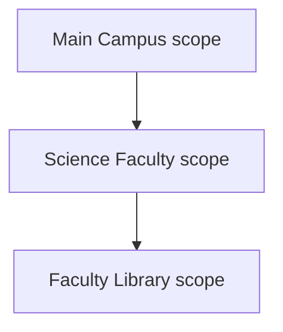
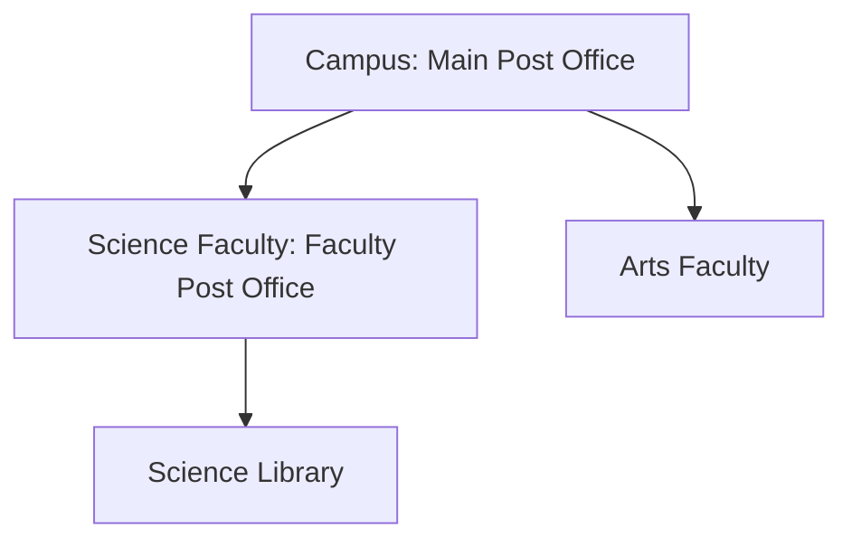

# Institutional Model

## Aetheric Forge Runtime 2.0

The institutional model defines how autonomous runtime entities are represented, composed, discovered, and governed within Aetheric Forge.

An Institution is the primary unit of constitutional responsibility and runtime composition. Every specialized Institution shares a small universal contract, while its purpose-specific capabilities remain on its own interface.

This document describes the software architecture of that model. Constitutional meaning and invariants remain authoritative in the repository's [`specs`](../../specs/) directory.

---

## Institution

An Institution is an independently identifiable runtime entity that:

- operates within an institutional context;
- may contain and register other Institutions;
- may resolve capabilities supplied by its own or an ancestor scope;
- participates in an explicit asynchronous lifecycle; and
- owns the Authorities, services, and machinery required by its specialized purpose.

The universal institutional contract remains deliberately small:

```csharp
public interface IInstitution
{
    IInstitutionContext Context { get; }

    void Register<TInstitution>(TInstitution institution)
        where TInstitution : class, IInstitution;

    bool TryResolve<TInstitution>(
        [NotNullWhen(true)] out TInstitution? institution)
        where TInstitution : class, IInstitution;

    TInstitution Resolve<TInstitution>()
        where TInstitution : class, IInstitution;

    Task InitializeAsync(
        CancellationToken cancellationToken = default);

    Task StartAsync(
        CancellationToken cancellationToken = default);

    Task StopAsync(
        CancellationToken cancellationToken = default);
}
```

`IInstitution` does not expose specialized Authorities or Campus-specific facilities. In particular, Archivists, Postmasters, Registrars, and Librarians are not universal properties of every Institution.

---

## Specialized Institutions

A specialized Institution extends `IInstitution` with only the public capabilities belonging to its constitutional role.

Examples include:

- `ICampus`
- `IArchive`
- `IPostOffice`
- `IRegistrar`
- `ILibrary`

A specialized interface is simultaneously:

- the public contract of that kind of Institution; and
- the capability contract under which an instance is registered and resolved.

Consumers depend upon the specialized interface rather than the concrete implementation.

```csharp
IArchive archive = institution.Resolve<IArchive>();
```

Resolution returns the Institution providing the capability. It does not expose the provider, service, or Authority used internally to fulfil that capability.

---

## Institutional Context

Every Institution receives an `IInstitutionContext`:

```csharp
public interface IInstitutionContext
{
    IInstitution? Parent { get; }

    IInstitutionTemplate Template { get; }

    IServiceProvider Services { get; }
}
```

The context establishes three distinct relationships.

### Parent

`Parent` identifies the containing Institution and establishes the path used for inherited capability resolution.

A null parent identifies a root institutional scope. In the 2.0 composition model, a Campus is a root Institution and therefore has no parent.

Parentage is structural. It should be fixed when the context is created and should not change during the lifetime of the Institution.

### Template

`Template` describes the institutional template from which the Institution is constituted. It supplies institutional definition and configuration without replacing the specialized runtime contract.

### Services

`Services` supplies implementation dependencies through ordinary dependency injection.

It is not an institutional capability registry. A service resolved from `IServiceProvider` is an implementation collaborator; an Institution resolved through `Resolve<TInstitution>()` is a constitutional capability visible through institutional scope.

Conflating the two would make hierarchy, ownership, and local override semantics dependent upon a container that does not represent them.

---

## Specialized Contexts

Each specialized Institution may define a corresponding context interface:

```csharp
public interface IArchiveContext : IInstitutionContext
{
}
```

An initially empty specialized context remains useful because it:

- preserves type safety at the institutional boundary;
- allows future extension without changing constructor identity;
- makes the expected context explicit; and
- prevents unrelated Institution types from being composed accidentally.

Specialized context interfaces should add members only when those members describe the environment of that Institution. Internal services belong in dependency injection or explicit constructor dependencies rather than being added to the context indiscriminately.

---

## Institutional Scope

Every Institution defines a local capability scope.

The scope contains registrations made directly on that Institution. Its parent scope is obtained through `Context.Parent`.



Institutional scope is lexical and hierarchical rather than global. The same capability contract may be provided by different Institutions in different branches of the hierarchy.

---

## Registration

Registration advertises an Institution as a capability of the current institutional scope.

```csharp
mainCampus.Register<IArchive>(mainArchive);
mainCampus.Register<IPostOffice>(mainPostOffice);
mainCampus.Register<IRegistrar>(mainRegistrar);
mainCampus.Register<ILibrary>(mainLibrary);
```

The generic contract is significant. An Institution is registered under the specialized interface by which consumers are permitted to discover it, not merely under its concrete runtime type.

### Registration invariants

A registration must satisfy the following rules:

- the registered value is not null;
- the value implements the requested institutional contract;
- the contract extends `IInstitution`;
- only one registration exists for a contract within a single scope; and
- the registered Institution belongs to the registering scope.

The final rule means that the registered Institution's `Context.Parent` is the Institution performing registration.

```csharp
ReferenceEquals(mainArchive.Context.Parent, mainCampus)
```

Registering an Institution owned by another scope is invalid. If the architecture later requires capability forwarding or federation, it should introduce that behaviour explicitly rather than weakening ownership semantics.

### Duplicate registration

A second registration for the same contract in the same scope is an error.

The runtime does not select arbitrarily among several local providers. Distinct providers should occupy distinct scopes or be exposed through a purpose-built aggregate contract.

### Registration is not dependency injection

Internal collaborators are not individually registered as institutional capabilities.

For example:

```csharp
mainCampus.Register<IArchive>(mainArchive); // correct
```

The Campus does not separately register the Archive's Archivist, vault, serializers, clerks, or storage providers. Those components remain encapsulated by the Archive.

---

## Resolution

Resolution discovers a registered Institution by specialized contract.

### Search order

Resolution follows a deterministic nearest-scope rule:

1. Search the current Institution's local registrations.
2. If the contract is registered locally, return that Institution.
3. Otherwise continue with `Context.Parent`.
4. Repeat until the contract is found or the root scope is exhausted.

The first matching scope wins.

### Required resolution

`Resolve<TInstitution>()` returns the nearest visible registration.

If no registration exists in the current or any ancestor scope, it throws. It is appropriate when the capability is required for the requesting operation or Institution.

```csharp
var postOffice = library.Resolve<IPostOffice>();
```

### Optional resolution

`TryResolve<TInstitution>()` reports whether the capability is available without using exceptions for control flow.

```csharp
if (institution.TryResolve<IArchive>(out var archive))
{
    // Use the resolved Archive.
}
```

The nullability annotation guarantees that a successful result supplies a non-null Institution.

### Local shadowing

A local registration shadows a matching registration inherited from an ancestor.

Suppose the Main Campus registers its Post Office. A Science Faculty beneath that Campus initially inherits the Main Campus Post Office. If the Faculty later registers a Faculty Post Office, descendants of the Faculty resolve the Faculty Post Office while other Campus branches continue to resolve the Main Campus Post Office.



The Science Library resolves the Faculty Post Office. The Arts Faculty resolves the Main Campus Post Office.

Shadowing supplies local specialization without mutating or replacing the ancestor registration.

---

## Campus Composition

A Campus is the root composition boundary and exposes the Institutions constitutionally required of a Campus.

```csharp
public interface ICampus : IInstitution
{
    IArchive Archive { get; }

    ILibrary Library { get; }

    IPostOffice PostOffice { get; }

    IRegistrar Registrar { get; }
}
```

These requirements belong to `ICampus`, not `IInstitution`.

A Campus implementation may expose them directly through resolution:

```csharp
public IArchive Archive => Resolve<IArchive>();
```

This avoids storing a second reference that could diverge from the registered capability.

### Two-phase composition

Campus composition occurs in two phases because descendant contexts refer to their parent Campus:

```csharp
var campus = new Campus(campusContext);

var archiveContext = new ArchiveContext(
    archiveTemplate,
    services,
    campus);

var archive = new Archive(
    archiveContext,
    vault,
    archivist);

campus.Register<IArchive>(archive);
```

The remaining required Institutions are created and registered in the same manner. Initialization then validates the completed composition.

Construction alone does not imply that the Campus is complete or ready to start.

---

## Ownership of Authorities

An Authority belongs to the specialized Institution whose constitutional responsibility it exercises.

Examples include:

- the Archive owns its Archivist;
- the Post Office owns its Postmaster;
- the Library owns its Librarian; and
- the Registrar owns its registration authority and supporting services.

The relevant specialized interface exposes its Authority when that Authority is part of the Institution's public operational surface:

```csharp
public interface IArchive : IInstitution
{
    IArchivist Archivist { get; }

    // Archive capabilities
}
```

An Authority is not elevated to a universal institutional property merely because a Campus must contain the Institution that owns it.

This preserves encapsulation and prevents recursive structures such as requiring every Registrar Institution to contain another Registrar.

---

## Lifecycle and Composition Validity

Institutional lifecycle is shared through `IInstitution`:

- `InitializeAsync`
- `StartAsync`
- `StopAsync`

Initialization is the boundary at which an Institution may validate that its required composition is present and internally coherent.

For a Campus, initialization should verify that every constitutionally required Institution has been registered. For a specialized Institution, initialization may validate its owned Authorities, services, providers, and configuration.

An Institution must not be started successfully when its required composition is incomplete.

Lifecycle mechanics and failure-state behaviour are described in the Runtime Model.

---

## Invariants

The institutional architecture preserves the following invariants:

- Every Institution has exactly one immutable institutional context.
- A Campus has no parent Institution.
- Every non-root Institution belongs to one parent scope.
- Institutional parentage contains no cycles.
- Registrations are unique by contract within a scope.
- Local registrations shadow, but do not mutate, ancestor registrations.
- Resolution is deterministic.
- Specialized requirements remain on specialized contracts.
- Authorities and implementation machinery remain owned by their specialized Institutions.
- Dependency injection does not substitute for institutional discovery.
- Infrastructure choices do not alter constitutional identity.

---

## Non-Goals

The 2.0 institutional resolver is not:

- a general-purpose dependency-injection container;
- a global service locator;
- a distributed service-discovery protocol;
- a load balancer;
- a named or keyed multi-provider registry; or
- a mechanism for exposing every internal service as a public capability.

Those facilities may exist elsewhere when required. They are not responsibilities of the institutional model.
