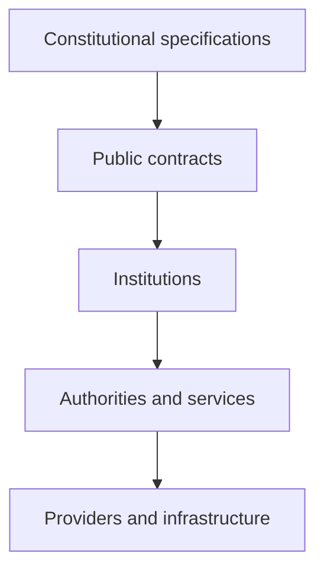

# Architecture Overview

## Aetheric Forge Runtime 2.0

The Aetheric Forge Runtime is a constitutional runtime for composing durable, autonomous Institutions.

Its architecture begins with institutional purpose rather than infrastructure. Constitutional specifications define what an Institution is responsible for and which invariants it must preserve. Runtime contracts translate those requirements into software boundaries, while implementations remain free to select appropriate services, providers, transports, and storage technologies.

This document provides the high-level map of that architecture. Detailed behaviour belongs in the constitutional specifications, public contracts, and focused architecture documents.

---

## Architectural Principles

### Constitution before implementation

Each constitutional Institution is defined first by a specification describing its purpose, authority, relationships, and invariants.

Code implements that constitution; it does not define or silently amend it.

The constitutional documents are maintained in the repository's [`specs`](../../specs/) directory.

### Institutions are the primary unit of composition

An Institution is an independently identifiable runtime entity with:

- a specialized public contract;
- an institutional context;
- a place in an institutional hierarchy;
- an explicit lifecycle; and
- responsibility for its own internal authorities and machinery.

Specialized Institutions extend the common institutional contract only with capabilities belonging to that kind of Institution.

### Capabilities are discovered through institutional scope

Institutions register other Institutions as capabilities within their scope.

A consumer resolves a capability locally first and then through successive parent scopes. A local registration shadows a registration inherited from an ancestor.

This permits a descendant Institution to use a capability supplied by its Campus while retaining the ability to establish a more local provider.

### Authorities belong to their Institutions

Authorities are not flattened into every Institution.

An Archive owns its Archivist. A Post Office owns its Postmaster. A Library owns its Librarian. A Registrar owns the authorities and services required to perform registration.

The containing scope registers the Institution, not each of its internal officers, services, or providers.

### Infrastructure is replaceable

Public institutional contracts do not depend upon a particular transport, serializer, database, object store, or hosting technology.

Infrastructure enters through narrow provider and service abstractions. This preserves institutional behaviour while allowing deployments to select implementations appropriate to their environment.

---

## Architectural Layers

### Constitutional specifications

Specifications establish institutional meaning and invariant behaviour. They are implementation-independent and use normative language to distinguish requirements from recommendations and permitted variation.

### Public contracts

Interfaces expose the stable capabilities required to interact with an Institution. They describe observable behaviour without exposing internal implementation choices.

### Institutions

Institution implementations coordinate their public capabilities, context, lifecycle, and internal collaborators. They are the principal runtime and composition boundary.

### Authorities and services

Authorities represent responsibilities exercised within an Institution. Services coordinate reusable operational behaviour. Both remain owned by the Institution whose constitutional purpose they serve.

### Providers and infrastructure

Providers adapt institutional services to concrete infrastructure. Examples include archival storage providers, postal transports, persistence systems, and serialization formats.

---

## Institutional Composition

### Campus

A Campus is the root institutional composition. Its context has no parent Institution.

For the 2.0 constitutional model, a Campus provides access to the principal Institutions required by the runtime:

- Archive
- Library
- Post Office
- Registrar

Campus-specific requirements belong to the Campus contract. They are not imposed upon every Institution.

### Descendant Institutions

Institutions beneath a Campus identify their parent through `IInstitutionContext`.

The parent relationship establishes the path used for inherited capability resolution. It does not flatten ownership: a capability remains owned and governed by the scope that registered it.

For example, a Science Faculty Library can resolve the Main Campus Post Office through its ancestors. If the Science Faculty later registers its own Post Office, descendants of that Faculty resolve the local Post Office instead.

### Registration and resolution

Registration associates an institutional contract with an Institution inside one scope.

Resolution follows these rules:

1. Search the current institutional scope.
2. Return the locally registered Institution when present.
3. Otherwise, search the parent scope.
4. Continue until a matching registration is found or the Campus root is reached.

Duplicate registrations for the same contract within one scope are invalid. The hierarchy supplies specialization through shadowing rather than ambiguous selection.

---

## Core Institutions

### Archive

The Archive preserves institutional history, provenance, and constitutional continuity. It owns the Archivist and coordinates archival storage through vault and provider abstractions.

### Post Office

The Post Office exchanges post within an institutional hierarchy. It owns its postal authority and separates institutional exchange semantics from transport-specific delivery.

### Registrar

The Registrar establishes authoritative institutional recognition. It records and attests institutional facts without owning or creating identity.

### Library

The Library curates knowledge for discovery, interpretation, teaching, and reuse. It distinguishes collection and recommendation from constitutional authority and historical record.

These Institutions are peers in the constitutional model. None is a universal property embedded within every `IInstitution`.

---

## Institutional Context

Every Institution receives an `IInstitutionContext` containing:

- its optional parent Institution;
- its institutional template; and
- its implementation service provider.

The context supplies the environment in which an Institution operates. Specialized context interfaces provide type-safe extension points without requiring every Institution to understand every other institutional type.

The implementation service provider and the institutional capability resolver serve different purposes:

- dependency injection supplies implementation collaborators;
- capability resolution discovers Institutions through constitutional scope.

They are intentionally not interchangeable.

---

## Lifecycle

Institutions share an explicit asynchronous lifecycle:

1. **Initialize** validates composition and prepares internal state.
2. **Start** begins active institutional operation.
3. **Stop** ends active operation and releases owned runtime resources.

Composition occurs before initialization. This allows a Campus to be created first, descendant Institutions to receive it as their parent, and those Institutions to be registered into Campus scope before the completed composition is validated.

Lifecycle implementations must respect cancellation and preserve valid state across failure and shutdown.

---

## Architectural Boundaries

The 2.0 architecture deliberately distinguishes:

- constitutional purpose from runtime mechanism;
- Institutions from their internal Authorities;
- institutional discovery from dependency injection;
- public contracts from provider implementations;
- active knowledge curation from constitutional history; and
- identity from authoritative institutional recognition.

These distinctions prevent specialized requirements from leaking into the universal Institution contract and keep infrastructure choices from becoming constitutional assumptions.

---

## Documentation Map

This overview is supported by the following focused documents:

- **Institutional Model** — Institution contracts, contexts, hierarchy, registration, resolution, and Campus composition.
- **Runtime Model** — lifecycle, Authorities, services, teams, and operational collaboration.
- **Infrastructure** — providers, transports, persistence, serialization, and environment-specific implementations.
- **Constitutional Specifications** — normative definitions and invariants for each constitutional entity and Institution.

The focused architecture documents describe how the runtime is organized. The constitutional specifications remain authoritative about why each Institution exists and what it must preserve.
