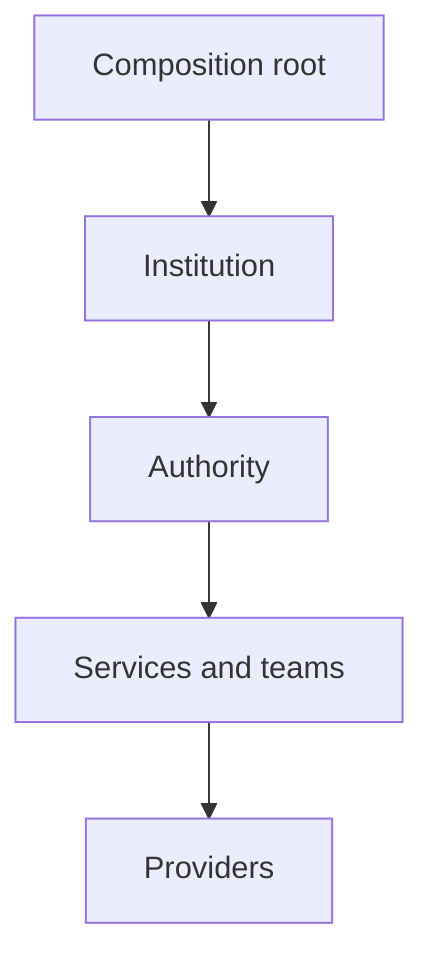
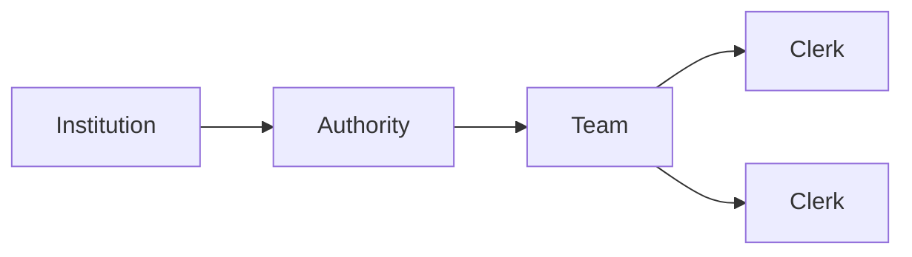

# Runtime Model

## Aetheric Forge Runtime 2.0

The runtime model describes how constituted Institutions are composed, initialized, operated, and stopped.

Constitutional specifications define institutional purpose and invariants. Public contracts define observable capabilities. The runtime supplies the execution model through which concrete Institutions, Authorities, services, teams, and providers collaborate.

This document concerns runtime behaviour and ownership. Institutional hierarchy and capability resolution are described in the [Institutional Model](institutional-model.md). Concrete transports, storage systems, serializers, and deployment technologies are described in the Infrastructure document.

---

## Runtime Responsibilities

The Runtime is responsible for:

- constructing institutional implementations;
- providing institutional contexts;
- composing parent and descendant Institutions;
- registering institutional capabilities;
- supplying implementation dependencies;
- validating completed compositions;
- coordinating institutional lifecycle;
- propagating cancellation and failure;
- supporting Authorities and their teams; and
- connecting institutional services to replaceable providers.

The Runtime interprets constitutional contracts but does not redefine them. An implementation choice cannot weaken a constitutional invariant merely because another mechanism would be more convenient.

---

## Runtime Structure



The diagram expresses responsibility rather than mandatory call order.

- The composition root constructs and connects Institutions.
- An Institution owns the Authorities required by its constitutional role.
- Authorities coordinate institutional work through services and teams.
- Services use providers at infrastructure boundaries.

Implementations may collapse layers when no meaningful boundary exists, but public ownership and constitutional responsibility must remain clear.

---

## Composition Root

The composition root creates a complete institutional hierarchy before active operation begins.

For a Campus composition, the canonical sequence is:

1. Construct the Campus context.
2. Construct the Campus.
3. Construct contexts for required descendant Institutions, identifying the Campus as parent.
4. Construct each descendant Institution and its owned collaborators.
5. Register each Institution under its specialized contract in Campus scope.
6. Initialize the completed composition.
7. Start active operation.

This is a deliberate two-phase composition model. The Campus must exist before descendant contexts can identify it as their parent, while the Campus cannot be considered complete until its required Institutions have been created and registered.

Construction establishes objects. Registration establishes institutional visibility. Initialization establishes readiness.

---

## Dependency Boundaries

The runtime uses two distinct dependency mechanisms.

### Constructor dependencies

Required, owned collaborators should be supplied explicitly to the implementation that uses them.

For example, an Archive may require:

- an Archive context;
- an Archive vault; and
- an Archivist.

Constructor injection makes ownership and minimum construction requirements visible. A required collaborator should not be hidden behind ambient lookup merely to shorten a constructor.

### Implementation services

`IInstitutionContext.Services` provides access to the implementation service container associated with an Institution.

It is appropriate for framework integration and implementation dependencies whose construction is managed by the host. It is not a substitute for institutional capability resolution.

### Institutional capabilities

Institutional capabilities are resolved through `IInstitution.Resolve<TInstitution>()` or `TryResolve<TInstitution>()`.

A Library seeking a Post Office resolves `IPostOffice` through institutional scope. It does not request `IPostOffice` from the implementation service provider.

This distinction preserves the institutional hierarchy even when all objects happen to share one dependency-injection container.

---

## Institution Implementation

A concrete Institution coordinates four concerns:

- its specialized public contract;
- its institutional context;
- its owned Authorities and services; and
- its lifecycle.

Institution implementations should remain thin where a narrower service owns the operational behaviour.

For example, an Archive delegates content storage and retrieval to its vault while retaining constitutional ownership of the archival capability. Delegation does not transfer institutional responsibility to the vault or provider.

Shared implementation behaviour may be supplied by an institutional base class. Such a base class should contain only behaviour common to every Institution, including local registration, hierarchical resolution, and universal lifecycle mechanics. Specialized Authorities and facilities do not belong there.

---

## Context

An institutional context is immutable runtime environment supplied to one Institution.

```csharp
public interface IInstitutionContext
{
    IInstitution? Parent { get; }

    IInstitutionTemplate Template { get; }

    IServiceProvider Services { get; }
}
```

### Parent

The parent fixes the Institution's structural position and inherited capability path.

Parentage should be established during construction and must not be reassigned during active operation.

### Template

The template supplies declarative institutional definition or configuration. Runtime state should not be written back into a template as though execution had amended the constitution.

### Services

The service provider supplies implementation dependencies. Its lifetime and scope should be compatible with the Institution that receives it.

### Specialized contexts

Specialized contexts extend `IInstitutionContext` only when a specialized Institution requires additional environmental information. An empty specialized context remains a valid type boundary and extension point.

---

## Authorities

An **Authority** is an operational actor entrusted with responsibility inside an Institution.

An Authority belongs to the Institution whose constitutional purpose it serves. It is exposed through that specialized Institution when consumers are permitted to invoke it directly.

Examples include:

- an Archivist within an Archive;
- a Postmaster within a Post Office;
- a Librarian within a Library; and
- registration authorities within a Registrar.

Authorities are not universal properties of `IInstitution` and are not independently registered merely because their owning Institution is registered.

An Authority may:

- validate an institutional operation;
- select an appropriate service or strategy;
- delegate work to a clerk or team;
- coordinate a multi-step operation;
- apply institutional policy; and
- return the result through the owning Institution's public contract.

Authority is contextual. Possessing an Authority object does not grant constitutional authority outside the Institution and scope that recognize it.

---

## Teams and Clerks

A **Clerk** performs a bounded category of institutional work under an Authority.

A **Team** groups interchangeable or cooperating Clerks behind a common contract. Teams allow an Authority to coordinate several implementations without exposing those implementations as separate institutional capabilities.



The runtime model does not require every Authority to possess a Team or every operation to involve a Clerk. These abstractions should be used when they express genuine responsibility, selection, or delegation.

Clerks remain internal to their owning Institution unless a separate constitutional contract deliberately exposes them.

---

## Services

A **Service** implements reusable operational behaviour required by an Institution or Authority.

Services differ from Institutions in several ways:

- they do not possess independent constitutional identity;
- they do not define institutional scope;
- they are not nodes in the institutional hierarchy;
- they do not own the Institution's authority; and
- they are ordinarily obtained through construction or dependency injection.

A service may coordinate several providers, enforce implementation-level rules, or present a stable operational boundary to an Authority.

For example, an Archive service may select an archival provider by store while the Archive vault presents storage operations to the Archive Institution. Neither service nor provider becomes the Archive itself.

---

## Providers

A **Provider** adapts runtime behaviour to a concrete implementation or external facility.

Providers sit at the edge of the runtime model. They may represent storage, transport, serialization, identity integration, or another replaceable mechanism.

An interface may fulfil more than one internal role when the contracts are genuinely equivalent. For example, an Archive provider may implement the Archive vault contract when the provider directly supplies the complete vault capability.

Such equivalence should be expressed through interface implementation rather than duplicated adapters with no distinct responsibility.

Provider selection, configuration, and technology-specific behaviour are covered in the Infrastructure document.

---

## Lifecycle

Every Institution participates in the shared asynchronous lifecycle:

```text
Constructed → Initialized → Started → Stopped
```

### Initialize

`InitializeAsync` prepares the Institution for operation and validates its completed composition.

Initialization may:

- verify required institutional registrations;
- validate configuration and templates;
- prepare owned services and providers;
- establish internal routes or subscriptions; and
- reject an incomplete or contradictory composition.

Initialization must not imply that active processing has begun.

### Start

`StartAsync` begins active institutional operation.

Starting may activate transports, workers, subscriptions, schedulers, or other runtime mechanisms owned by the Institution.

An Institution should not start before successful initialization.

### Stop

`StopAsync` ends active operation and allows owned runtime resources to be released or quiesced.

Shutdown should prevent new work from being accepted where appropriate, allow governed in-flight work to complete or cancel, and leave externally owned dependencies untouched unless ownership explicitly says otherwise.

### Ordering

Lifecycle ordering follows dependency rather than mere containment. A dependency must be ready before an operation that requires it begins. Shutdown ordinarily reverses the effective startup dependency order.

The composition root is responsible for coordinating lifecycle when no enclosing Institution owns that responsibility directly.

---

## Cancellation

Public asynchronous operations accept a `CancellationToken` where interruption is meaningful.

Cancellation should propagate through the complete operational path:

```text
Institution → Authority → Service → Provider
```

A layer should not replace the caller's token with an unrelated token or silently discard cancellation unless it has an explicit responsibility to establish a separate lifetime.

Cancellation signals that the requesting operation should stop. It does not automatically imply rollback, deletion, or failure of work already accepted by an external system.

Implementations must distinguish cancellation from domain failure and from normal negative results such as “not found.”

---

## Failure

Failures should remain meaningful at the boundary where they occur.

The runtime distinguishes:

- invalid arguments;
- incomplete composition;
- missing institutional capabilities;
- invalid lifecycle transitions;
- unavailable providers;
- domain-level negative results;
- cancellation; and
- unexpected implementation failure.

An implementation should not convert all failures into null, false, or a generic success result. Public contracts may use null or boolean results when absence is an intentional domain outcome, but operational failure must remain distinguishable.

When a delegated operation fails, the owning Institution remains responsible for presenting that failure according to its public contract.

---

## State and Concurrency

Institutional state belongs to the narrowest component responsible for governing it.

- constitutional state belongs to the Institution and its constitutional records;
- lifecycle state belongs to the runtime implementation;
- operational coordination state belongs to the relevant Authority or service;
- infrastructure state belongs to the provider that manages it.

Shared mutable state should not be introduced merely to make components globally reachable. Capability resolution supplies reachability; it does not make an Institution's internal state public.

Implementations must define concurrency at the contract boundary they expose. Thread safety, ordering, duplication, and reentrancy must not be assumed solely because operations are asynchronous.

---

## Ownership and Disposal

Runtime ownership determines responsibility for stopping and disposing resources.

An Institution owns collaborators it creates directly or whose ownership is explicitly transferred to it. Dependencies supplied by an external container are not automatically owned by the consuming Institution.

Streams, messages, contexts, providers, and other disposable resources should have one clearly documented owner at each stage of an operation.

Delegation does not imply transfer of ownership unless the contract says so.

---

## Runtime Invariants

The runtime model preserves the following invariants:

- Construction, registration, initialization, and startup remain distinct phases.
- Institutional parentage is fixed before active operation.
- Required composition is validated before an Institution starts.
- Institutional capabilities are resolved through institutional scope.
- Implementation dependencies are supplied through construction or service resolution.
- Specialized Authorities remain owned by specialized Institutions.
- Teams, Clerks, services, and providers do not acquire institutional identity by participation.
- Delegation does not transfer constitutional responsibility.
- Cancellation propagates across asynchronous operational boundaries.
- Domain absence, cancellation, and operational failure remain distinguishable.
- Resource ownership is explicit.
- Runtime mechanisms remain subordinate to constitutional contracts.

---

## Non-Goals

The runtime model does not prescribe:

- a particular dependency-injection framework;
- one hosting or deployment model;
- a universal workflow engine;
- a mandatory actor or threading model;
- a single transport or persistence technology;
- distributed consensus among Institutions; or
- automatic exposure of internal services as public capabilities.

Those concerns may be supplied by infrastructure or higher-level systems without altering the constitutional runtime model.
